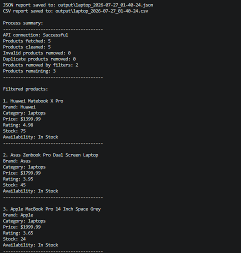

# E-Commerce Product Data Collector

A Python command-line application that fetches product data from an API, validates and cleans the records, removes duplicates, filters and sorts the results, and exports them as JSON and CSV reports.

## Project Purpose

The purpose of this project is to automate the process of collecting and organizing product data.

The application allows users to search for products, define filtering criteria, sort the results, and generate structured output files.

This version uses DummyJSON as a demonstration API. The project can later be adapted to real public APIs or permitted web data sources.

## Project Status

The current version is fully functional. It can fetch, validate, clean, filter, sort, and export product data.

The project is actively maintained and will be expanded with automated tests, type hints, improved documentation, and additional reporting features.

## Features

- Search products by keyword
- Fetch all matching products from the API
- Validate user input
- Reject invalid numbers, including `NaN` and infinity
- Validate numeric fields received from the API
- Handle missing product data
- Remove invalid records
- Remove duplicate products
- Filter products by minimum price, maximum price, and minimum rating
- Sort products by price, rating, or stock
- Export results to JSON and CSV
- Generate safe timestamped filenames
- Display a process summary
- Handle API, connection, timeout, data, and file output errors

## Technologies Used

- Python
- Requests
- JSON
- CSV
- Regular expressions
- Datetime
- OS
- Math

## Requirements

- Python 3.10 or newer
- Internet connection

## Project Structure

```text
ecommerce-product-collector/
├── assets/
│   └── terminal-demo.png
├── examples/
│   ├── sample_products.json
│   └── sample_products.csv
├── output/
├── main.py
├── README.md
├── ROADMAP.md
├── requirements.txt
└── .gitignore
```

The `output` directory is created automatically when the application runs.

## Installation

Clone the repository:

```bash
git clone https://github.com/niisa0/ecommerce-product-collector.git
```

Move into the project directory:

```bash
cd ecommerce-product-collector
```

Install the required package:

```bash
python -m pip install -r requirements.txt
```

## Usage

Run the application:

```bash
python main.py
```

The program will ask for:

```text
Enter a product keyword:
Enter minimum price:
Enter maximum price:
Enter minimum rating:
Choose a sort option (1-4):
```

## Example Usage

```text
Enter a product keyword: phone
Enter minimum price: 100
Enter maximum price: 1500
Enter minimum rating: 3

Sort options:
1 - Price: Low to High
2 - Price: High to Low
3 - Rating: High to Low
4 - Stock: High to Low

Choose a sort option (1-4): 2
```


## Demo

The following screenshot shows a filtered laptop search and the generated process summary.




## Example Process Summary

```text
Process summary:
----------------------------------------
API connection: Successful
Products fetched: 23
Products cleaned: 23
Invalid products removed: 0
Duplicate products removed: 0
Products removed by filters: 3
Products remaining: 20
----------------------------------------
```

The numbers in the summary may change depending on the keyword, filters, and API data.

## Output Files

Sample JSON and CSV reports are available in the [`examples`](examples) directory.

Reports generated while running the application are saved inside the `output` directory.

Example filenames:

```text
phone_2026-07-26_20-30-45.json
phone_2026-07-26_20-30-45.csv
```

Each exported product may contain:

- ID
- Title
- Brand
- Category
- Price
- Discount percentage
- Rating
- Stock
- Availability status
- Shipping information
- Thumbnail URL

## Data Source

This project currently uses the [DummyJSON Products API](https://dummyjson.com/docs/products).

DummyJSON provides mock data for development, learning, and testing. This application does not claim to provide real-time product prices or live store inventory.

## Development Background

This application was developed step by step as a hands-on Python project. I implemented, tested, and refined each feature while practicing API integration, validation, error handling, file operations, and clean code organization.

## What I Learned

While building this project, I practiced:

- Working with REST APIs
- Sending HTTP requests with `requests`
- Processing JSON data
- Validating user input
- Handling invalid and missing data
- Removing duplicate records
- Filtering and sorting lists of dictionaries
- Exporting data to CSV and JSON
- Creating reusable functions
- Organizing a Python application with `main()`
- Handling network and file errors
- Using Git and GitHub during project development

## Future Improvements

- Add type hints
- Add docstrings
- Add automated tests
- Split the project into separate modules
- Add logging
- Add configuration support
- Add Excel reports with pandas
- Add permitted web scraping with BeautifulSoup
- Add dynamic page support with Selenium
- Connect the project to a real public product data source

## Roadmap

See [ROADMAP.md](ROADMAP.md) for planned improvements and future versions.